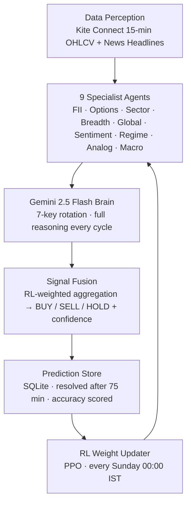

# RITAM

<div align="center">

## Not prediction. Perception.

**RITAM** is a self-improving multi-agent AI system for real-time Nifty 50 market intelligence.\
Nine specialist agents act as sensors. Gemini 2.5 Flash acts as the reasoning brain.\
The system gets smarter every week — automatically.

[](https://www.python.org/)
[](https://fastapi.tiangolo.com/)
[](https://deepmind.google/technologies/gemini/)
[](https://huggingface.co/ProsusAI/finbert)
[](https://www.sqlite.org/)
[](#roadmap)

</div>

---

## The Idea

Markets rarely move in isolation. They react to narrative, liquidity, volatility, policy, overnight cues, and memory.
RITAM is built to capture that structure.

Instead of treating market prediction as a single-model problem, RITAM is a layered intelligence system:

- Ingests live Nifty 50 OHLCV data + Indian market headlines every 5 minutes
- Scores sentiment with FinBERT
- Reasons over all signals with Gemini 2.5 Flash (7-key rotation, effectively unlimited free throughput)
- Searches history for comparable 15-minute market windows via cosine + DTW analog matching
- Fuses 9 specialist agent signals into a BUY / SELL / HOLD with confidence
- Resolves every prediction after 75 minutes and scores agent accuracy
- Updates agent weights every Sunday via PPO reinforcement learning

The system output:

```json
{
  "timestamp": "2026-04-15T10:30:00+05:30",
  "predicted_direction": "up",
  "confidence": 0.74,
  "timeframe_minutes": 15,
  "regime": "trending_up",
  "analog_similarity": 0.81,
  "top_agents": ["FIIDerivativeAgent", "SentimentAgent"],
  "explanation": "FII long buildup + positive macro sentiment matches Mar 2021 analog"
}
```

---

## Why It Stands Out

- **India-market native** — built around Nifty 50, GIFT Nifty, IST timing, Kite Connect
- **9 specialist agents** — FII derivatives, options chain, sector rotation, market breadth, global markets, sentiment, regime, analogs, macro — running in parallel
- **Gemini as the brain** — 7-key rotation means zero throttling, zero cost, Gemini-quality reasoning on every cycle
- **Self-improving** — three compounding loops: RL weight updates, growing analog memory, Gemini in-context learning over prediction history
- **Honest uncertainty** — when analog similarity is low and agents disagree, confidence drops and the system says so
- **Rs500/month total cost** — only Kite Connect is paid

---

## Architecture



### Core Stack

| Area | Tools |
|---|---|
| Language | Python 3.11+ |
| Market data | Zerodha Kite Connect + yfinance fallback |
| Sentiment | FinBERT |
| LLM reasoning | Gemini 2.5 Flash / Flash-Lite (7-key rotation) |
| Analog matching | Cosine similarity + DTW |
| Reinforcement learning | Stable-Baselines3 PPO |
| Scheduler | APScheduler (5-min cycles) |
| Storage | SQLite → PostgreSQL at deploy |
| API | FastAPI + WebSockets |
| Frontend | React + Vite + TypeScript + Tailwind CSS |

---

## What’s Live Today

| Layer | What It Does | Status |
|---|---|---|
| Core | 9 agents + orchestrator + Gemini brain | ✅ Live |
| L0 | Gemini 7-key rotation with fallback chain | ✅ Live |
| L1 | APScheduler — prediction cycle every 5 min | ✅ Live |
| L2 | 9 macro agents in parallel execution | ✅ Live |
| L3 | 15-min intraday analog finder (20-candle windows, 5-candle outcomes) | ✅ Live |
| L4 | RL weight updater — per-agent accuracy tracked, weights updated weekly | ✅ Live |
| L5 | Paper trading engine — virtual P&L track record | 🔄 In progress |
| L6 | Signal quality + 3-month backtest + walk-forward validation | ⏳ Next |
| L7 | Live prediction chart — 15-min ahead, self-correcting, confidence meter | ⏳ Planned |
| L8 | Sandbox — “What If” Time Machine | ⏳ Planned |
| L9 | Landing page + waitlist + invite-only deploy | ⏳ Planned |
| L10 | Public pricing + launch | ⏳ Planned |

---

## Repository Map

```text
src/
  api/              FastAPI server, WebSocket, all endpoints
  agents/           9 specialist agents + signal aggregator
  backtest/         Backtrader baseline engine
  config/           settings, agent weight config
  data/             Kite + yfinance, intraday seeder, news fetcher, DB helpers
  feedback/         prediction/outcome tracker
  learning/         intraday resolver, RL weight updater, accuracy calculator
  orchestrator/     MarketOrchestrator.run_cycle() — main prediction loop
  paper_trading/    virtual position tracker, P&L engine (L5)
  reasoning/        analog finder (daily + intraday), regime classifier
  rl/               PPO environment and trainer
  sentiment/        headline preprocessor, FinBERT scorer
frontend/           React dashboard (Signal, Accuracy, Analogs, Explanation, AgentWeights)
tests/              unit + integration tests across all modules
scripts/            seed_historical.py, seed_intraday.py, verify_db.py
reports/            backtest HTML reports (generated)
config/             agent_weights.json baseline
```

---

## Quick Start

### 1. Clone and create a virtual environment

```bash
git clone https://github.com/DevWizard-Vandan/ritam
cd ritam
python -m venv venv
```

Activate:

```bash
# Windows PowerShell
venv\Scripts\Activate.ps1

# macOS / Linux
source venv/bin/activate
```

### 2. Install dependencies

```bash
pip install -r requirements.txt
```

### 3. Create your `.env`

```env
KITE_API_KEY=
KITE_API_SECRET=
KITE_ACCESS_TOKEN=
NEWS_API_KEY=
GEMINI_API_KEY_1=
GEMINI_API_KEY_2=
GEMINI_API_KEY_3=
GEMINI_API_KEY_4=
GEMINI_API_KEY_5=
GEMINI_API_KEY_6=
GEMINI_API_KEY_7=
DB_PATH=data/market.db
LOG_LEVEL=INFO
ENV=development
PAPER_CAPITAL=100000
PAPER_LOT_SIZE=50
```

> Never hardcode API keys. `.env` only.

### 4. Initialize the database

```bash
python -c "from src.data.db import init_db; init_db()"
```

### 5. Seed historical data

```bash
python scripts/seed_historical.py
python scripts/seed_intraday.py
```

### 6. Run the server

```bash
uvicorn src.api.server:app --host 0.0.0.0 --port 8000 --reload
```

### 7. Run the dashboard

```bash
cd frontend
np install
npm run dev
```

Dashboard at `http://localhost:5173`.

### 8. Run tests

```bash
pytest tests/ -v
```

---

## API Endpoints

| Method | Endpoint | Description |
|---|---|---|
| GET | `/api/candles` | Latest daily candles |
| GET | `/api/prediction` | Latest signal, regime, sentiment, explanation, confidence |
| GET | `/api/agents/stats` | Per-agent weights, 7d/30d accuracy, total predictions |
| GET | `/api/weights/history` | Weight history for a given agent |
| GET | `/api/feedback/accuracy` | Overall prediction accuracy stats |
| GET | `/api/analogs` | Last 3 historical analogs with similarity scores |
| GET | `/api/intraday/candles` | Latest 15-min intraday candles |
| GET | `/api/intraday/stats` | Intraday sync stats |
| GET | `/api/paper/trades` | Last 50 paper trades |
| GET | `/api/paper/stats` | Win rate, total P&L, Sharpe ratio, open position |
| GET | `/api/backtest/latest` | Latest backtest result as JSON |
| POST | `/api/weights/update` | Manually trigger RL weight update |
| WS | `/ws/predictions` | Real-time signal stream |

---

## The Bigger Vision

### L7 — Live Prediction Chart
A live candlestick chart that stays 15 minutes ahead of the market, continuously self-corrects, and shows a confidence band. Pre-market predictions at 9:00 AM using GIFT Nifty + global overnight cues. Regime badge, event overlay, agent signal bars.

### L8 — The Sandbox: “What If” Time Machine
The most powerful feature. Pick any date in history, add a condition (“What if RBI cut rates by 1% unexpectedly”), and watch the system animate a predicted Nifty path in real time using analog matching + regime classification + macro reasoning. No retail tool does this.

### L9 — Invite-Only Launch
A landing page with a waitlist, a 60-second demo video, and a curated Discord for early users. Daily signals posted automatically to `#predictions`. Early users shape which sandbox scenarios get built first.

### L10 — Public Launch
Tiered access: free = delayed signals, paid = live signals + sandbox. API access for developers.

---

## Self-Improvement Loops

RITAM gets measurably smarter over time through three compounding mechanisms:

1. **RL weight updates** — agents that were right last week get more voting power. Agents that were wrong get suppressed. Fires every Sunday automatically.
2. **Analog memory growth** — every resolved prediction adds to the historical pattern library. More history = better analog matches = better predictions.
3. **Gemini in-context learning** — recent prediction history + outcomes are passed to Gemini on each cycle. No fine-tuning cost. The brain reasons better as evidence accumulates.

---

## Developer Rules

Before touching anything:

1. Read `AGENTS.md` — architecture bible, never modify
2. Read `STATUS.md` — always update after work
3. Read `DECISIONS.md` — 11 ADRs, never modify
4. API keys in `.env` only — never hardcoded
5. Every new module needs a test file in `tests/`
6. Branch naming: `feature/module-name`
7. DB changes must be additive — no ALTER on existing tables

---

## Monthly Cost

| Tool | Cost |
|---|---|
| Kite Connect | Rs500 |
| Gemini API (7 keys, free tier) | Rs0 |
| Jules / Copilot / Codex | Rs0 |
| **Total** | **Rs500** |

---

<div align="center">

RITAM treats markets as structured behavior, not noise.\
News, volatility, analog history, and agent disagreement are first-class signals.\
The goal is not just “up” or “down” — but *why*, *how strongly*, *in what regime*, and *what history says next*.

**Built by [Vandan Sharma](https://github.com/DevWizard-Vandan)**

</div>
