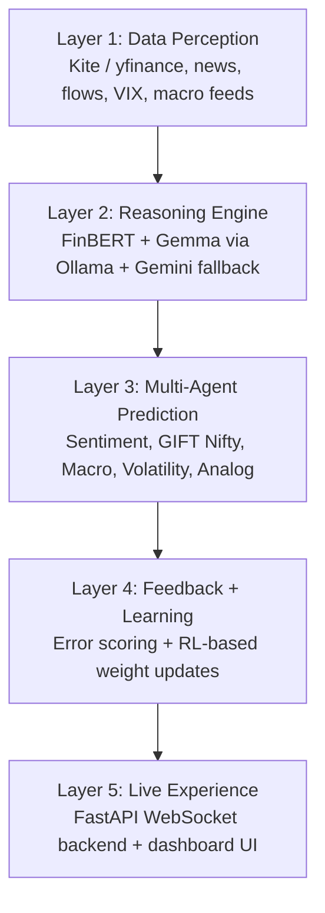

# RITAM

<div align="center">

## Not prediction. Perception.

**RITAM** is an AI-native market intelligence system for the Nifty 50 ecosystem.  
It combines market data, financial sentiment, local LLM reasoning, historical analog search,
multi-agent signal fusion, and feedback-driven learning to estimate what may happen next.

[](https://www.python.org/)
[](https://fastapi.tiangolo.com/)
[](https://huggingface.co/ProsusAI/finbert)
[](https://ollama.com/)
[](https://www.sqlite.org/)
[](#roadmap)

</div>

---

## The Idea

Markets rarely move in isolation. They react to narrative, liquidity, volatility, policy, overnight cues, and memory.
RITAM is built to capture that structure.

Instead of treating market prediction as a single-model problem, RITAM is designed as a layered intelligence system that:

- ingests Nifty 50 market data and Indian market headlines
- scores sentiment with FinBERT
- reasons over context with local Gemma models through Ollama
- searches history for comparable market regimes and analog events
- aggregates specialist agent signals into a probabilistic short-horizon view
- learns from prediction error over time

The long-term target is a live output such as:

```json
{
  "timestamp": "2026-04-06T10:30:00+05:30",
  "predicted_direction": "up",
  "predicted_move_pct": 0.42,
  "confidence": 0.74,
  "timeframe_minutes": 20,
  "signals_used": ["sentiment", "gift_nifty", "macro", "volatility", "analog"],
  "regime": "event_driven",
  "historical_analog": {
    "match": "March 2020 COVID bounce",
    "similarity": 0.73,
    "analog_outcome": "+8% over 10 sessions"
  }
}
```

## Why It Stands Out

RITAM is not just a dashboard, a backtest, or a sentiment toy.

- **India-market focused**: centered on Nifty 50, GIFT Nifty, and market-specific timing in IST.
- **Local-first reasoning**: Gemma via Ollama is the primary LLM path before any paid fallback.
- **Historical analog intelligence**: the system does not only score the present; it asks what this moment resembles.
- **Multi-agent design**: specialist signals are meant to collaborate rather than collapse into one opaque model.
- **Feedback loop orientation**: every prediction is intended to become future training signal.

## Architecture



### Core stack

| Area | Tools |
| --- | --- |
| Language | Python 3.11+ |
| Market data | Zerodha Kite Connect, yfinance fallback |
| Sentiment | FinBERT |
| Local reasoning | Gemma 4 via Ollama |
| Agent orchestration | LangGraph |
| Backtesting | Backtrader |
| Reinforcement learning | Stable-Baselines3 |
| Storage | SQLite in development |
| API | FastAPI + WebSockets |

## What Exists Today

The repository already includes meaningful implementation across the stack:

- `src/data/`: market data helpers, SQLite persistence, headline ingestion, scheduler support
- `src/sentiment/`: headline cleaning and FinBERT scoring
- `src/reasoning/`: Gemma client, regime classification, analog matching
- `src/backtest/`: Backtrader-based strategy engine
- `src/rl/`: trading environment and PPO training pipeline
- `src/api/`: FastAPI REST and WebSocket server
- `src/orchestrator/`: orchestration scaffold that fuses sentiment, regime, and analog signals
- `tests/`: unit coverage across data, reasoning, backtest, RL, API, sentiment, and orchestrator modules

### In progress

- multi-agent orchestration foundation
- feedback loop and weekly weight updates
- dashboard experience
- deeper analog-agent integration

## Repository Map

```text
src/
  api/            FastAPI server and WebSocket streaming
  agents/         signal aggregation logic
  backtest/       Backtrader engine
  config/         settings and weight config
  data/           data ingestion and database helpers
  learning/       feedback and learning hooks
  orchestrator/   orchestration entrypoints
  reasoning/      Gemma client, analog matching, regime logic
  rl/             PPO training environment and trainer
  sentiment/      headline preprocessing and FinBERT scoring
tests/            unit and integration-style tests
TASKS/            project task breakdown by phase
```

## Quick Start

### 1. Clone and create a virtual environment

```bash
git clone <your-repo-url>
cd ritam
python -m venv .venv
```

Activate it:

```bash
# Windows PowerShell
.venv\Scripts\Activate.ps1

# macOS / Linux
source .venv/bin/activate
```

### 2. Install dependencies

```bash
pip install -r requirements.txt
```

### 3. Create your `.env`

Create a `.env` file in the project root and add the variables you need:

```env
KITE_API_KEY=
KITE_API_SECRET=
KITE_ACCESS_TOKEN=
NEWS_API_KEY=
DB_PATH=data/market.db
LOG_LEVEL=INFO
ENV=development
```

Notes:

- `NEWS_API_KEY` improves headline coverage, but RSS fallback is already supported.
- `DB_PATH` defaults to `data/market.db` if omitted.
- No API keys should ever be hardcoded into source files.

### 4. Initialize the database

```bash
python -c "from src.data.db import init_db; init_db()"
```

### 5. Run the test suite

```bash
pytest tests/ -v
```

## Local LLM Setup

RITAM is designed to prefer **local Gemma models via Ollama** before using any cloud fallback.

Install Ollama, then pull the models you want available:

```bash
ollama pull gemma4:2b
ollama pull gemma4:26b
ollama serve
```

Recommended behavior:

- use `gemma4:2b` for fast local reasoning
- use `gemma4:26b` for deeper analog and macro reasoning when hardware permits
- fall back only when local inference is unavailable or insufficient

## Running the Project

### Start the API server

```bash
uvicorn src.api.server:app --host 0.0.0.0 --port 8000 --reload
```

Available endpoints:

- `GET /api/candles`
- `GET /api/accuracy`
- `GET /api/agents`
- `WS /ws/predictions`

### Fetch and persist market headlines

```python
from src.data.news_fetcher import fetch_headlines

headlines = fetch_headlines()
print(headlines[:5])
```

### Score sentiment with FinBERT

```python
from src.sentiment.scorer import score_headlines

results = score_headlines([
    "Markets rally after strong earnings and easing inflation concerns",
    "Global selloff deepens as recession fears return"
])

for item in results:
    print(item)
```

### Run one orchestration cycle

```python
from src.orchestrator.agent import MarketOrchestrator

orchestrator = MarketOrchestrator()

result = orchestrator.run_cycle(
    last_candle={"price_change_pct": 0.38},
    recent_daily_candles=[],
    vix=14.5,
)

print(result)
```

## Frontend

The RITAM dashboard is a React + TypeScript single-page application in `frontend/`.

```bash
cd frontend && npm install && npm run dev
```

See [frontend/README.md](frontend/README.md) for full details.

## Product Vision

RITAM is moving toward a live intelligence surface with:

- real-time candlesticks and prediction zones
- agent confidence bars and fused signal view
- historical analog cards for current market context
- prediction-versus-reality tracking
- reinforcement updates based on weekly performance

The goal is not just to say "up" or "down".  
The goal is to explain *why*, *how strongly*, *in what regime*, and *what history suggests next*.

## Roadmap

| Phase | Focus | Status |
| --- | --- | --- |
| 1 | Data pipeline | In progress |
| 2 | Sentiment engine | Implemented foundation |
| 3 | Gemma reasoning layer | Implemented foundation |
| 4 | Backtesting engine | Implemented foundation |
| 5 | Multi-agent system | In progress |
| 6 | Feedback + RL loop | Partially scaffolded |
| 7 | Live dashboard | Planned |
| 8 | Cloud deployment | Planned |

## Developer Workflow

Before making changes:

1. Read `AGENTS.md`.
2. Read `STATUS.md`.
3. Read `DECISIONS.md`.
4. Keep API keys in `.env` only.
5. Add or update tests for new behavior.

Project conventions include:

- snake_case for Python files and functions
- IST as the canonical market timezone
- local Gemma before Gemini
- no deletion of working code or tests

## Current Gaps

This README reflects the current repository honestly:

- the dashboard UI is part of the vision, not yet the finished experience
- some architecture layers are scaffolded ahead of full production integration
- prediction quality claims are a target outcome, not a validated promise yet

That is a strength, not a weakness: the project already contains the foundations of a serious system, and the remaining work is clearly structured.

## Contributing

If you are contributing or collaborating:

- check `TASKS/` for the current work breakdown
- follow the architecture decisions in `DECISIONS.md`
- update `STATUS.md` after meaningful work
- keep changes focused, testable, and reversible

## Closing Note

RITAM is an attempt to model markets as structured behavior rather than noise.
It treats news, volatility, analog history, and agent disagreement as first-class signals.

If that vision resonates with you, this repository is not just code.  
It is the beginning of a market perception engine.
