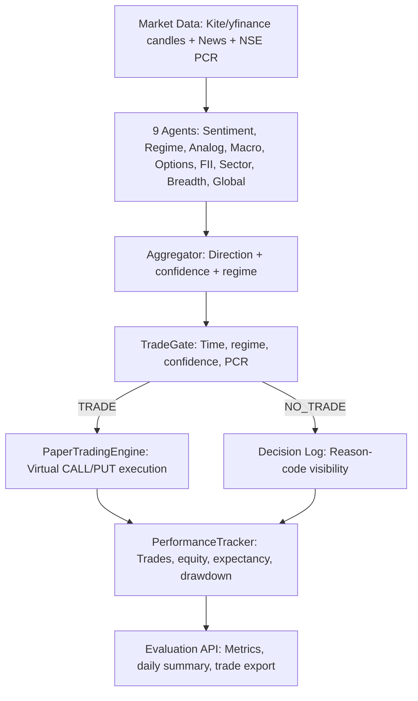

# RITAM

<div align="center">

## Not prediction. Perception.

**RITAM v2** is a multi-agent Nifty 50 intelligence system refactored into a disciplined intraday paper-trading evaluation stack.

Agents perceive the market. TradeGate decides if the prediction is tradable. PerformanceTracker measures whether the system has positive expectancy.

</div>

---

## Current Runtime Flow

```text
Data -> Agents -> Aggregator Prediction -> TradeGate -> Paper Execution or Skip -> Expectancy Tracking -> Evaluation Metrics
```

RITAM is currently in paper-trading evaluation mode. The goal is not to tune; the goal is to collect clean 4-week evidence.

Locked success criteria:

| Metric | Target |
|---|---:|
| Expectancy | greater than Rs0.50 per Rs1 risked |
| Win rate | greater than 45% |
| Max daily drawdown | less than 5% |
| Max total drawdown | less than 15% |
| Evaluation period | 4 weeks, no parameter tuning |

---

## What It Does

- Ingests Nifty market data from Kite Connect when configured, with yfinance fallback for local/dev use.
- Ingests news from NewsAPI and RSS feeds.
- Runs 9 specialist agents covering sentiment, regime, analogs, macro, options, FII, sector, breadth, and global cues.
- Uses Gemini 2.5 Flash with 7-key rotation for reasoning and Gemini Flash-Lite for quick tasks.
- Uses FinBERT for financial headline sentiment.
- Produces prediction/confidence/regime context.
- Applies deterministic TradeGate rules before any paper trade.
- Fetches Nifty PCR from NSE and applies deterministic neutral/penalty/extreme handling.
- Tracks paper trades, skipped decisions, equity, expectancy, win rate, and drawdown in SQLite.
- Exposes API endpoints for data freshness, evaluation metrics, trade journal export, and daily summaries.

---

## Architecture



---

## Core Modules

| Path | Responsibility |
|---|---|
| `src/orchestrator/agent.py` | Main cycle: agents -> TradeGate -> paper execution/skip |
| `src/trading/trade_gate.py` | Deterministic TRADE/NO_TRADE decision engine |
| `src/trading/pcr_fetcher.py` | NSE option-chain PCR fetcher with headers, retries, TTL cache, stale detection |
| `src/trading/performance_tracker.py` | SQLite trade/decision journal, expectancy, win rate, drawdown |
| `src/trading/evaluation_mode.py` | Metrics snapshot, daily summaries, readiness validation, safeguards |
| `src/trading/evaluation_config.py` | Frozen evaluation constants |
| `src/data/market_health.py` | Data freshness and source diagnostics |
| `src/data/kite_client.py` | Kite Connect integration with yfinance fallback |
| `src/api/server.py` | FastAPI, scheduler, startup checks, API endpoints, WebSocket |
| `src/paper_trading/engine.py` | Local virtual paper trading engine |

---

## TradeGate Rules

TradeGate blocks a trade when:

- Regime is not one of `trending_up` or `trending_down`.
- Current time is 09:15-09:30 IST or 15:00-15:30 IST.
- Adjusted confidence is below `0.65`.
- PCR is extreme outside deterministic safety bands.
- Evaluation safety guards report a system error or PCR has been unavailable too long.

PCR behavior:

| PCR Range | Behavior |
|---|---|
| `0.8 <= PCR <= 1.3` | Neutral, no confidence penalty |
| Near outer bands | Deterministic confidence penalty |
| Extreme | NO_TRADE |
| Unavailable briefly | Neutral fallback, explicitly logged |
| Unavailable too long | Safety skip |

Strategy thresholds are frozen during evaluation.

---

## Quick Start

### 1. Create and activate a virtual environment

```powershell
python -m venv venv
venv\Scripts\Activate.ps1
```

### 2. Install dependencies

```powershell
pip install -r requirements.txt
```

### 3. Configure `.env`

Keep secrets only in `.env` or deployment secrets.

```env
KITE_API_KEY=
KITE_API_SECRET=
KITE_ACCESS_TOKEN=
NEWS_API_KEY=
GEMINI_API_KEY_1=
GEMINI_API_KEY_2=
GEMINI_API_KEY_3=
GEMINI_API_KEY_4=
GEMINI_API_KEY_5=
GEMINI_API_KEY_6=
GEMINI_API_KEY_7=
DB_PATH=ritam.db
LOG_LEVEL=INFO
ENV=development
PAPER_CAPITAL=100000
PAPER_LOT_SIZE=50
```

### 4. Initialize database

```powershell
python -c "from src.data.db import init_db; init_db()"
```

### 5. Seed data if needed

```powershell
python scripts/seed_historical.py
python scripts/seed_intraday.py
```

### 6. Start API

```powershell
uvicorn src.api.server:app --host 0.0.0.0 --port 8000 --reload
```

### 7. Start frontend

```powershell
cd frontend
npm install
npm run dev
```

Frontend runs at `http://localhost:5173`.

### 8. Run tests

```powershell
python -m pytest tests/ -q
```

---

## Essential Monitoring Endpoints

| Method | Endpoint | What to Check |
|---|---|---|
| GET | `/health` | API process is alive |
| GET | `/api/scheduler/status` | Scheduler is running |
| GET | `/api/data/health` | Data source, last candle timestamp, delay, OK/STALE |
| GET | `/api/evaluation/metrics` | Trades, win rate, expectancy, drawdown, equity, NO_TRADE reasons |
| GET | `/api/evaluation/daily/latest` | Latest end-of-day summary |
| GET | `/api/evaluation/trades` | Manual trade journal review |
| GET | `/api/paper/trades` | Paper trade history |
| GET | `/api/paper/stats` | Paper P&L and open position state |
| WS | `/ws/predictions` | Live cycle stream |

---

## Healthy Day-1 Behavior

- Data health is `OK` during market hours.
- TradeGate logs structured TRADE/NO_TRADE decisions.
- First 15 minutes and last 30 minutes should normally produce `NO_TRADE` due restricted windows.
- Zero trades can be normal if regime/confidence/PCR conditions are not aligned.
- One losing trade is not meaningful by itself.
- More than 3 trades in a day should raise a warning, not trigger tuning.
- Repeated `SYSTEM_ERROR`, stale data, or missing PCR beyond the safety window requires investigation.

---

## Repository Map

```text
src/
  agents/           9 specialist agents and aggregator
  api/              FastAPI server, scheduler, WebSocket, endpoints
  backtest/         Backtrader baseline engine
  config/           settings and constants
  data/             Kite/yfinance, news, DB, market health
  feedback/         prediction/outcome tracking
  learning/         resolver, RL weight updater, accuracy calculator
  orchestrator/     MarketOrchestrator runtime cycle
  paper_trading/    virtual execution engine
  reasoning/        Gemini client, analog finder, regime classifier
  rl/               PPO environment and trainer
  sentiment/        headline preprocessing and FinBERT scoring
  trading/          TradeGate, PCR, expectancy, evaluation mode
frontend/           React dashboard
tests/              unit and integration tests
scripts/            data seeding and verification scripts
config/             agent weight configuration
```

---

## Developer Rules

Before structural work:

1. Read `AGENTS.md`.
2. Read `STATUS.md`.
3. Read `DECISIONS.md`.
4. Do not edit `.env`.
5. Add tests for new modules.
6. Keep DB changes additive.
7. Do not tune strategy parameters during evaluation mode.
8. Update `STATUS.md` when work is complete.

---

## Monthly Cost

| Tool | Cost |
|---|---:|
| Kite Connect | Rs500/month |
| Gemini API via free-tier key rotation | Rs0 |
| Local FinBERT | Rs0 |
| SQLite local evaluation | Rs0 |
| Total | Rs500/month |

---

RITAM now measures what matters: not just whether an agent can predict direction, but whether the full decision loop produces positive expectancy under disciplined constraints.
